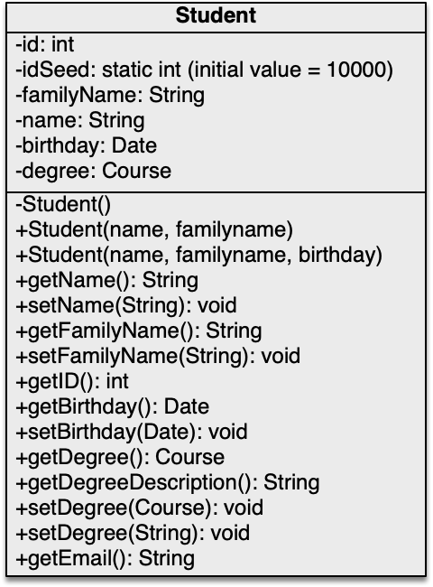

# OOP - WS 2023/24 - Exercise 03

## Object Oriented Programming - 2309 - Prof. Ronny Hartanto

 

---  

### Maximum number of "**commit/push**" for this exercise is **5**

> If you commit/push into the repository more than 5 times, you will not get any points for this homework. 
> Initially, github will create your repository by filling it up with necessary contents. Therefore, you will start with x commits. The commit/push limitation is counted toward your commits, thus you should not exceed the x + 5 commits in total to receive the points for this homework. 

--- 

## Assignments

1. Implement the **Student** class as depicted in the UML-Diagram below. (in Student.java) Make sure the class meets the following conditions / behaviours:   
* The *idSeed* has value 10000 initially and keep incrementing for every new student object. 
* The student's id is assigned during instantiation using current *idSeed* value before increment.  
* The *Course* is data type enumeration with the following content: ME, MSE, EL, IE, BMS, SCB, MME, MBB. This datatype already provided in the project folder. (Course.java)  
* It is also possible to set the studycourse using a string value like “IE”, “EL”, "MSE", etc.  
* *getDegreeDescription* will return a complete human readable study course, i.e.,  
  * ME = “Mechanical Engineering, B.Sc.”, 
  * MME=”Mechanical Engineering, M.Sc.”, 
  * MBB=”Bionics, M.Sc.”, 
  * (plese refer to actual study program in our faculty: https://www.hochschule-rhein-waal.de/en/faculties/technology-and-bionics/degree-programmes).  
* Use java.util.Date for the Date   
* *getEmail* will return the student's email, composed of "name.familyName@hsrw.org"

 

2. Design a class named **CryptoCurrency** that contains:  
* A string data field named *symbol* for the currency’s symbol.
* A string data field named *name* for the currency’s name.
* Create the getter and setter for *symbol* and *name*
* An array of double data field name *priceHistory* that stores the currency price for
the last 10 days in Euro.
* Create a method *getPreviousClosingPrice* to retrieve the yesterday price.
* Create a method *getCurrentPrice* to retrieve the current price.
* Create a method *setCurrentPrice* to register the current price. This method will also store the previously stored value as yesterday closing price.
* A constructor that creates a crypto currency with the specified *symbol* and *name*. (in that order)
* A method named getChangePercent() that returns the percentage changed from previousClosingPrice to currentPrice.
* A method named getAveragePrice() that return the average price based on the price history.  
Draw the UML diagram for the class then implement the class. Upload your UML diagram in UML folder. Create your own java file inside the main java folder, where the Student.java is located.

---

## Instruction
You have to work on your local machine to do this homework. Don't use the WebIDE as it will use up your "commit/push" tokens. 

**Please follow the following steps:**
1. Clone the repository into your local computer. (you can use terminal or any Git client)
2. Open the local repository on your local computer using your favourite editor (text editor or IDE)
3. Work on your assigment solve all the given problem, make sure they run on your computer. **Don't change the structure of the directory**
4. If you completed all the assigments, *commit* your change to Git and *push* it to the Github (using your GitClient or terminal)
5. Check your submission by visiting your Github repository, after a while you should be able to see the result (:white_check_mark: or :x:)
6. If you have :white_check_mark: then you are done with your homework, otherwise repeat step 3 onward. 

--- 

## Important

You can ONLY change files inside the **src/main/java** folder and place your name in this readme file. Depending on your task, you might need to create a new class in the **src/main/java** folder. Please don't make any modification anywhere else. 

**Make sure you submit your homework before the deadline.** 
> If you submit after the deadline, it will not be graded

---
## Notes
* **WS2023/24** The points are not part of the final assessment. This purely exercise to help you learn Java programming.
* The submission will be evaluated automatically (most of the case)!
* If it doesn't compile, it could be some mistakes on your submission. 
* You will receive the points upon successful solving the tasks. 
* You can make or modify your submission before the deadline
* Make sure you don't exceed the limit, sometime it's better to get partial points than exceeding the limit. 
* Use this homework to practice your programming skill
